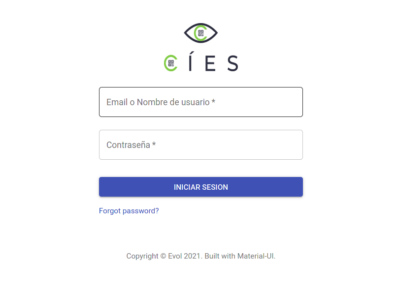
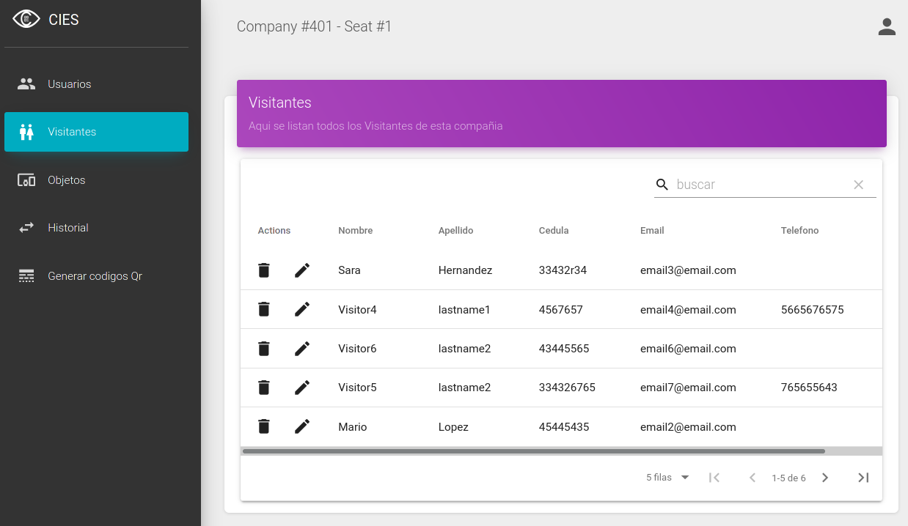
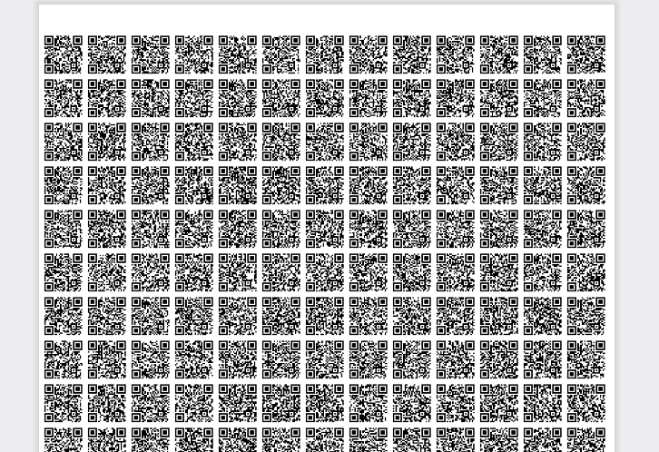

This project was bootstrapped with [Create React App](https://github.com/facebook/create-react-app).

<!-- PROJECT LOGO -->
<br />
<p align="center">
  <a href="https://github.com/d1sd41n/CIES_app_web_frontend">
    
  </a>

  <h3 align="center">CIES App Web Frontend</h3>

  <p align="center">
    An awesome sistem to register the items that enter and leave your facility automatically!!
    <br />
  </p>
</p>

<!-- TABLE OF CONTENTS -->
<details open="open">
  <summary>Table of Contents</summary>
  <ol>
    <li>
      <a href="#about-the-project">About The Project</a>
      <ul>
        <li><a href="#built-with">Built With</a></li>
      </ul>
    </li>
    <li>
      <a href="#getting-started">Getting Started</a>
      <ul>
        <li><a href="#prerequisites">Prerequisites</a></li>
        <li><a href="#installation">Installation</a></li>
      </ul>
    </li>
    <li><a href="#usage">Usage</a></li>
    <li><a href="#roadmap">Roadmap</a></li>
    <li><a href="#contributing">Contributing</a></li>
    <li><a href="#license">License</a></li>
  </ol>
</details>


<!-- ABOUT THE PROJECT -->
## About The Project

CIES is an app to automatically register items that enter and leave a company facilities using QR codes and a cell phone camera. Automatically records in a database all the details of each item that enters or leaves the installation, It also allows to create automatic reports in case of item loss and allows the automatic sending of emails to inform the owner of the lost item if it is found


The project is divided into three subprojects: backend, web frontend, mobile frontend; each one in its respective repository. 
This repository is the Web frontend code source


Features implemented in the web frontend:
* Login and user session
* Form to create users
* Table to list, search, edit and delete users
* Table to list, search, edit and delete visitors
* Table to list, search, edit and delete Items
* Table to list and search for events in the history of enters and leaves of items in the facilities of a company
* Form to generate QR codes and download a pdf file with ordered qr codes for printing

Here are some screenshots what the UI looks like:






### Built With

* [node.js](https://nodejs.org/)
* [react.js](https://reactjs.org/)
* [Redux.js](https://redux.js.org/)
* [Material-ui](https://material-ui.com/)

<!-- GETTING STARTED -->
## Getting Started

### Prerequisites

In order to use this project you must have node.js installed on your operating system and you must have the backend working


### Installation

1. Clone the repo
   ```sh
   https://github.com/d1sd41n/CIES_app_web_frontend.git
   ```
2- Enter the project directory and install the node packages
  ```sh
   npm i
   ```
3- set the backend url, In the module:
```sh
src/variables/backendURL.js
```
you will find the variable of type string "backendUrl", modify it and place the url towards your backend
```js
const backendUrl = "http://My_backend_URL.example";


export default backendUrl;
```

it is important not to write a slash in the last character of the url

##### backendUrl = "http://My_backend_URL.example/" WRONG!!!!!!!!!! >:(

##### backendUrl = "http://My_backend_URL.example" GOOD!!!!  :D

4- Run the project

```sh
npm start
```


You can deploy the project to a platform like [Vercel](https://vercel.com/)

<!-- CONTRIBUTING -->
## Contributing

Contributions are what make the open source community such an amazing place to be learn, inspire, and create. Any contributions you make are **greatly appreciated**.

1. Fork the Project
2. Create your Feature Branch (`git checkout -b feature/AmazingFeature`)
3. Commit your Changes (`git commit -m 'Add some AmazingFeature'`)
4. Push to the Branch (`git push origin feature/AmazingFeature`)
5. Open a Pull Request


<!-- LICENSE -->
## License

Distributed under the MIT License. See `LICENSE` for more information.


<!-- CONTACT -->
## Authors

Daniel Pérez - [Twitter](https://twitter.com/1l_dan) - [github.com/d1sd41n](https://github.com/d1sd41n) 
